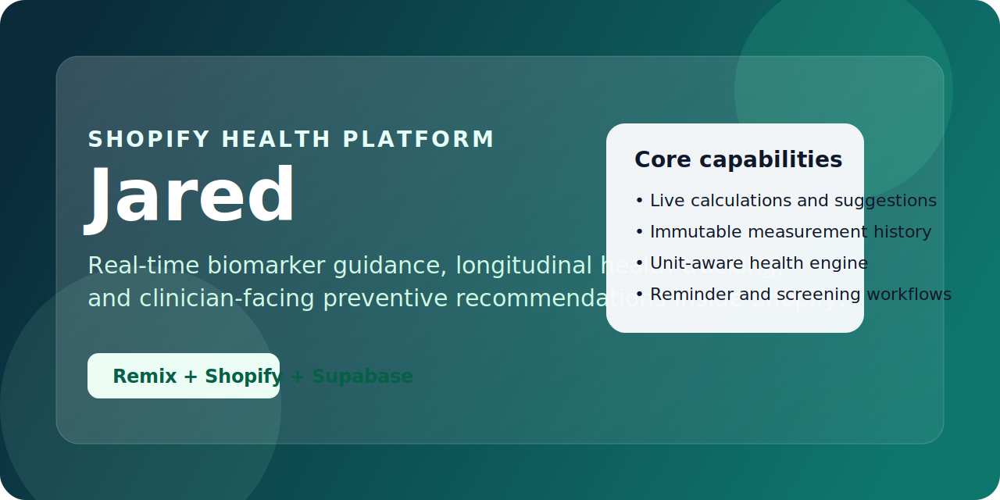
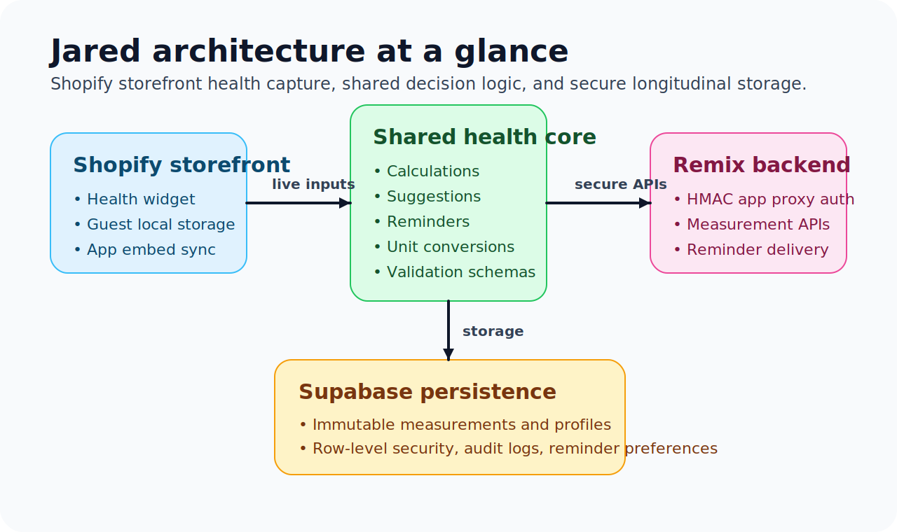

# Health Roadmap Tool

A personalized health management tool embedded in a Shopify storefront. Users input their health metrics (body measurements, blood tests) and receive real-time personalized suggestions to discuss with their healthcare provider. Health data is stored as immutable time-series records, allowing users to track their metrics over time.



## Overview

Jared combines a Shopify storefront widget, a shared health-calculation engine, and a secure Remix/Supabase backend so customers can:

- capture biomarkers and body measurements in real time
- receive structured preventive suggestions to discuss with a clinician
- maintain an immutable longitudinal health history
- manage reminders for screenings, blood tests, and medication review



## Features

- **Two-panel interface**: Input form on the left, live results on the right
- **Real-time calculations**: Results update as users type
- **Unit system support**: Automatic locale detection (SI for NZ/AU/UK/EU, conventional for US) with manual toggle, synced to database for logged-in users
- **Immutable measurement history**: Apple Health-style data model (no edits, only add/delete)
- **SI canonical storage**: All values stored in SI units (kg, cm, mmol/L, mmol/mol, mmHg) to eliminate unit ambiguity
- **Guest mode**: Works without signup (data saved to localStorage)
- **Shopify login sync**: Logged-in customers automatically save data to cloud (HMAC-verified)
- **Background sync**: App embed block syncs guest localStorage data to Supabase on any storefront page after login
- **Personalized suggestions**: Based on clinical guidelines for BMI, HbA1c, LDL, blood pressure, etc.
- **HIPAA audit logging**: All write operations logged for compliance (no PHI in metadata)
- **Account data deletion**: Users can delete all their data with a single click (measurements, profile, auth user)
- **Email reminder notifications**: Daily cron sends HIPAA-aware reminders when screenings, blood tests, or medication reviews are due. Per-category opt-out with group-level cooldowns (90d screening, 180d blood test, 365d medication). Token-based unsubscribe preferences page.

## Prerequisites

- Node.js 20+
- A [Shopify Partner](https://partners.shopify.com/) account
- A [Supabase](https://supabase.com/) project
- A [Fly.io](https://fly.io/) account (for backend hosting)

## Setup

### 1. Clone and install

```bash
git clone <repo-url>
cd roadmap
npm install
```

### 2. Create a Shopify app

1. Go to [Shopify Partners](https://partners.shopify.com/) and create a new app
2. Note the **Client ID** and **Client Secret**

### 3. Configure Shopify app

```bash
cp shopify.app.toml.example shopify.app.toml
```

Edit `shopify.app.toml`:
- Set `client_id` to your app's Client ID
- Set `application_url` to your Fly.io app URL (e.g. `https://your-app.fly.dev`)
- Update `redirect_urls` and `[app_proxy] url` to match

### 4. Configure Fly.io

```bash
cp fly.toml.example fly.toml
```

Edit `fly.toml`:
- Set `app` to your Fly.io app name

### 5. Set up environment variables

```bash
cp .env.example .env
```

Edit `.env` with your Supabase credentials (found in Supabase Dashboard > Settings > API).

### 6. Set up Supabase database

Run the SQL migration in your Supabase SQL Editor:

```bash
# Copy the contents of supabase/rls-policies.sql into the Supabase SQL Editor and run it
```

This creates:
- **profiles** table — Maps Shopify customer IDs to Supabase Auth user IDs (`shopify_customer_id` is nullable for future mobile-only users)
- **health_measurements** table — Immutable time-series health records with `metric_type`, `value` (SI canonical units), and `recorded_at`
- **audit_logs** table — HIPAA audit trail for all write operations (anonymized on account deletion)
- **Auth trigger** — Auto-creates a profile row when a Supabase Auth user is created
- **get_latest_measurements()** RPC — Efficiently returns the latest value per metric type (scoped by `auth.uid()`)
- **CHECK constraints** — Per-metric-type value range validation at the database level
- **RLS policies** — Enforced access control using `auth.uid()` (SELECT, INSERT, DELETE; no UPDATE)

### 7. Deploy

```bash
# Deploy Shopify extensions (widget + sync embed)
npm run build:widget
npx shopify app deploy --force

# Deploy backend to Fly.io
fly deploy

# Set secrets on Fly.io
fly secrets set SUPABASE_URL=https://your-project.supabase.co
fly secrets set SUPABASE_SERVICE_KEY=your-service-key
fly secrets set SUPABASE_ANON_KEY=your-anon-key
fly secrets set SUPABASE_JWT_SECRET=your-jwt-secret
```

### 8. Install on your Shopify store

1. **Install the app** on your Shopify store and accept the required permissions (`write_app_proxy`, `read_customers`)
2. **Enable the "Health Data Sync" app embed** — In the Theme Editor, go to **App Embeds** and toggle on **"Health Data Sync"**. This runs silently on every storefront page and syncs guest localStorage data to Supabase when the user logs in.
3. **Create a Roadmap page** — Online Store > Pages > Add page (e.g. title "Health Roadmap", URL handle `roadmap` → `/pages/roadmap`)
4. **Add the "Health Roadmap Tool" block** to the Roadmap page — In the Theme Editor, navigate to the Roadmap page, click **Add block**, and select **"Health Roadmap Tool"**
5. **Create a Health History page** — Online Store > Pages > Add page (e.g. title "Health History", URL handle `health-history` → `/pages/health-history`)
6. **Add the "Health History" block** to the History page — In the Theme Editor, navigate to the History page, click **Add block**, and select **"Health History"**
7. **Configure customer account extensions** — The "Health Roadmap Link" extension auto-deploys to the customer account profile page and order history page after app install. Go to **Settings > Customer accounts**, customize the customer account pages, and set the `roadmap_url` setting to your store's roadmap page URL (e.g. `https://yourdomain.com/pages/roadmap`)
8. **Verify** — Test guest mode (no login), logged-in mode, guest→logged-in data sync (enter data as guest, log in, confirm it appears), history page, and customer account links

## Architecture

```
┌─────────────────────────────────────────────────────────────────┐
│  Theme Widget (Storefront)                                       │
│  ├── Guest: localStorage (works without login)                  │
│  ├── Logged in: Auto-detects Shopify customer                   │
│  └── Calls backend measurement API for cloud sync               │
├─────────────────────────────────────────────────────────────────┤
│  App Embed Sync Block (every storefront page)                    │
│  └── Background localStorage→Supabase sync for logged-in users  │
├─────────────────────────────────────────────────────────────────┤
│  Backend API (Remix App on Fly.io)                                │
│  ├── GET/POST/DELETE /api/measurements (HMAC auth)              │
│  ├── DELETE /api/user-data (account deletion, HMAC auth)        │
│  └── Dual Supabase clients (admin + RLS-enforced user client)   │
├─────────────────────────────────────────────────────────────────┤
│  Shared Library (packages/health-core)                            │
│  ├── Unit conversions (SI ↔ conventional)                        │
│  ├── Health calculations (IBW, BMI, protein target)              │
│  ├── Suggestion generation (unit-system-aware)                   │
│  └── Field↔metric mappings, validation schemas                   │
├─────────────────────────────────────────────────────────────────┤
│  Supabase Database (RLS enabled)                                  │
│  ├── profiles (shopify_customer_id → user mapping)              │
│  ├── health_measurements (immutable time-series records)         │
│  ├── reminder_preferences + reminder_log (email reminders)       │
│  └── audit_logs (HIPAA audit trail, anonymized on deletion)      │
└─────────────────────────────────────────────────────────────────┘
```

## Authentication & Security

All health data for logged-in customers is protected by Shopify's app proxy HMAC signature verification. The widget never calls the backend directly.

### Data Flow

```
Guest (not logged in):
  Widget → localStorage (no server calls)

Logged-in customer (storefront widget):
  Widget → /apps/health-tool-1/api/measurements (same-origin request)
         → Shopify app proxy adds logged_in_customer_id + HMAC signature
         → Fly.io backend verifies HMAC via authenticate.public.appProxy()
         → Extracts verified customer ID from signed query params
         → Maps Shopify customer → Supabase Auth user
         → Creates RLS-scoped client (anon key + custom JWT)
         → RLS enforces auth.uid() on every query
```

### Why This Is Secure

- **HMAC-verified identity**: Shopify signs every proxied request with the app's secret key. The `logged_in_customer_id` parameter cannot be forged — any tampering invalidates the signature.
- **No client-side secrets**: No API keys, tokens, or customer IDs are exposed in client code.
- **No CORS**: Requests go through Shopify's proxy (same origin as the storefront).
- **Server-side authorization**: The backend never trusts client-supplied identity. Customer ID always comes from the HMAC-verified query parameters.
- **Row Level Security**: Supabase RLS policies enforce data isolation at the database level. All data queries use an anon key + custom JWT scoped to `auth.uid()` — the service key is only used for user creation.
- **Error boundaries**: React error boundaries prevent component crashes from taking down the entire tool.

## Project Structure

```
/roadmap
├── /app                          # Remix app (Shopify admin + API)
│   ├── /lib
│   │   └── supabase.server.ts    # Dual Supabase clients, JWT signing, CRUD
│   └── /routes
│       ├── api.measurements.ts   # Measurement CRUD API (HMAC auth)
│       ├── api.reminders.ts     # Reminder preferences + unsubscribe page
│       └── api.user-data.ts     # Account data deletion (HMAC auth)
├── /packages
│   └── /health-core              # Shared library
│       └── /src
│           ├── calculations.ts   # IBW, BMI, protein target
│           ├── suggestions.ts    # Recommendation generation (unit-aware)
│           ├── units.ts          # Unit definitions, conversions, thresholds
│           ├── mappings.ts       # Field↔metric mappings, data conversion
│           ├── reminders.ts      # Pure reminder logic (computeDueReminders)
│           ├── validation.ts     # Zod schemas
│           └── types.ts          # TypeScript interfaces
├── /widget-src                   # React widget source code
│   └── /src
│       ├── /components           # HealthTool, InputPanel, ResultsPanel
│       └── /lib
│           ├── storage.ts        # localStorage + unit preference
│           └── api.ts            # Measurement API client (app proxy)
├── /extensions
│   └── /health-tool-widget       # Shopify theme extension (widget + sync embed)
├── /supabase
│   └── rls-policies.sql          # DB schema + RLS policies
└── Dockerfile                    # Docker build for Fly.io
```

## Health Calculations

| Metric | Formula | Source |
|--------|---------|--------|
| Ideal Body Weight | Devine Formula: 50kg + 0.91 × (height - 152.4cm) for males | Clinical standard |
| Protein Target | 1.2g × IBW | Evidence-based recommendation |
| BMI | weight / height² | WHO standard |
| Waist-to-Height Ratio | waist / height | Metabolic risk indicator |

## Testing

```bash
npm test              # Run all 138 tests once
npm run test:watch    # Watch mode
```

## Development

```bash
npm run build:widget     # Build the health widget
npm run dev:widget       # Watch widget for changes
npm run deploy           # Deploy extensions to Shopify CDN
fly deploy               # Deploy backend to Fly.io
```

## Troubleshooting

### Measurements not saving (500 errors)

If measurements return 500 errors after deployment, check the Fly.io logs (`fly logs --no-tail`) for these common issues:

**`admin=false` / email is null**: The Shopify offline access token is missing from the PostgreSQL session table. Re-authenticate by visiting the app in Shopify admin, or uninstall and reinstall the app.

**"A user with this email address has already been registered"**: The Supabase Auth user exists but the `profiles` row is missing or doesn't match the `shopify_customer_id`. The `getOrCreateSupabaseUser()` function handles this by looking up the existing auth user by email and re-creating the profile row.

**"violates foreign key constraint health_measurements_user_id_fkey"**: The `user_id` doesn't exist in the `profiles` table. This is a symptom of the above issue — the profile wasn't created properly.

### After redeploying to Fly.io

Shopify sessions are stored in Supabase PostgreSQL, so deploys don't affect session persistence. The app runs stateless on Fly.io with no persistent volume.

## Disclaimer

This tool is for educational purposes only and is not a substitute for professional medical advice. Users should always consult with their healthcare provider before making health decisions.
